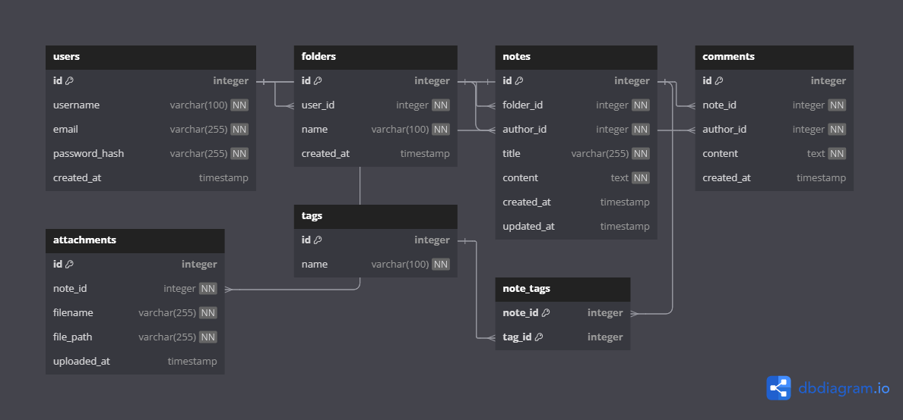

# Knowledge Management API

A RESTful backend API for managing personal knowledge, inspired by applications such as Notion. The project is built with FastAPI and PostgreSQL using asynchronous SQLAlchemy and follows a structured backend engineering roadmap from basic CRUD operations to production-ready architecture.

## Features

- Asynchronous FastAPI application
- PostgreSQL database
- SQLAlchemy 2.0 Async ORM
- Alembic database migrations
- User management
- Folder management
- Note management
- Comment management
- Attachment management
- Tag management
- Many-to-Many Note–Tag relationship
- RESTful CRUD API

## Technology Stack

- Python 3
- FastAPI
- PostgreSQL
- SQLAlchemy 2.0
- AsyncPG
- Alembic
- Pydantic v2
- Uvicorn

## Project Structure

```text
knowledge-management-api/
│
├── alembic/
│   ├── versions/
│   ├── env.py
│   └── script.py.mako
│
├── app/
│   ├── models/
│   ├── routers/
│   ├── schemas/
│   ├── database.py
│   ├── main.py
│   └── config.py
│
├── assets/
│   └── erd.png
│
├── alembic.ini
├── requirements.txt
└── README.md
```

## Database Schema



## API Resources

| Resource | Description |
|----------|-------------|
| Users | User management |
| Folders | Organize notes |
| Notes | Store knowledge |
| Comments | Note discussions |
| Attachments | File attachments |
| Tags | Note categorization |

## Installation

Clone the repository.

```bash
git clone https://github.com/<username>/knowledge-management-api.git
cd knowledge-management-api
```

Create a virtual environment.

```bash
python -m venv .venv
```

Activate the virtual environment.

Windows

```bash
.venv\Scripts\activate
```

Linux / macOS

```bash
source .venv/bin/activate
```

Install dependencies.

```bash
pip install -r requirements.txt
```

## Database Setup

Create a PostgreSQL database.

Update the database connection string inside the project configuration.

Apply all migrations.

```bash
alembic upgrade head
```

## Running the Application

Development server:

```bash
fastapi dev app/main.py
```

or

```bash
uvicorn app.main:app --reload
```

The API will be available at

```
http://127.0.0.1:8000
```

Swagger UI

```
http://127.0.0.1:8000/docs
```

ReDoc

```
http://127.0.0.1:8000/redoc
```

## Database Migrations

Create a migration.

```bash
alembic revision --autogenerate -m "Migration description"
```

Apply migrations.

```bash
alembic upgrade head
```

Rollback the last migration.

```bash
alembic downgrade -1
```

## Development Roadmap

- Project Configuration
- Database Layer
- Architecture & Software Engineering
- Authentication
- Validation
- Error Handling
- REST API Design
- Testing
- Deployment
- Backend Security

## License

This project is developed for educational purposes.