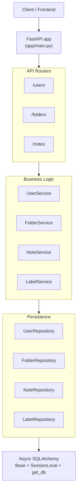
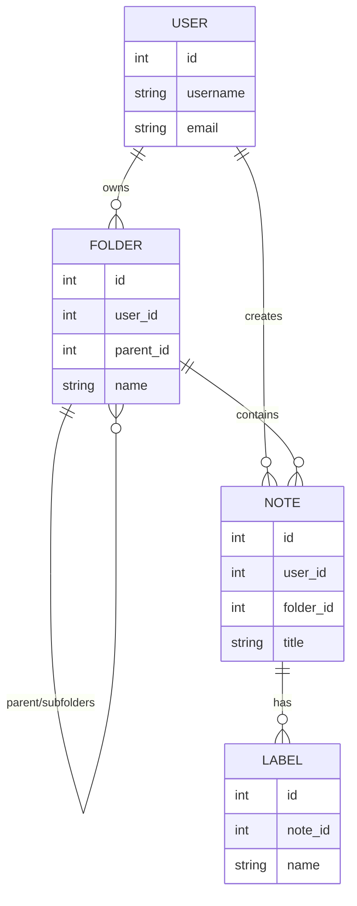
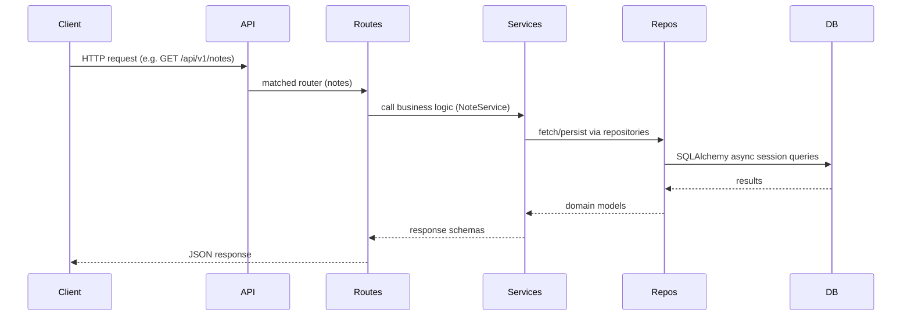

## Knowledge Management API — concise architecture

This file shows a compact Mermaid visualization of the project's layers and database relationships.

### High-level architecture

### Data model relationships

### Typical request flow

### Where to look in the code

- app/main.py: FastAPI entrypoint and middleware
- app/api/v1/router.py and app/api/v1/routers/*: endpoints
- app/services/*: application business rules
- app/repositories/*: database access
- app/models/*: SQLAlchemy models and relationships
- app/core/*: config, database, exceptions

If you'd like a presentation-ready version or a narrower focus (only DB ERD or only request flows), tell me which and I'll produce it.
